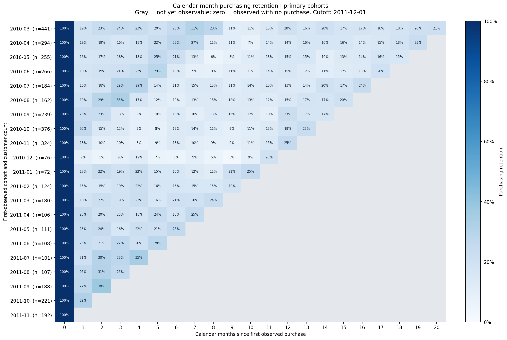

# E-Commerce Customer Retention & Cohort Analysis

**A complete SQL + Python portfolio project connecting purchase history to measurable retention decisions.**

**Status: all 14 planned steps completed.** The project includes validated analytical tables, one executed notebook, six charts, an aggregate HTML dashboard, an English case study, and a successful rebuild from the original workbook in a fresh output directory.

## Start here

- **Business story:** [case study and recommendations](reports/case_study.md).
- **Interactive summary:** download or clone the folder, then open [the local dashboard](dashboard/index.html) in your browser. GitHub previews HTML as source; it does not execute this dashboard in the repository view.
- **Technical evidence:** [SQL analysis](sql/), [metric definitions](data_dictionary.md), and [reproducibility report](reports/reproducibility.md).
- **Original scope:** [business context, audience, and eight analytical questions](reports/project_plan.md).

## Business question

**How can an e-commerce team prioritize retention initiatives using repeat purchasing, cohort performance, and observed customer value?**

The intended audience is growth, CRM, commercial, and business management teams. The workflow demonstrates skills relevant to marketplace analytics and applications for Data Analyst roles in Ho Chi Minh City. The data describes a **historical UK gift retailer with wholesale activity**; it is not Shopee/Lazada or Vietnamese customer data. Local commercial use would require contemporary local validation.

## Key findings

| Finding | Evidence | Decision it informs |
|---|---|---|
| 41.14% repeated within 90 days | 1,452 of 3,529 fully observed primary-cohort customers | Test a second-purchase program using a randomized holdout |
| Top 10% contributed 63.56% of identified historical sales | 583 of 5,821 customers | Monitor dependence on large accounts and evaluate service support |
| 1,728 repeat-history accounts were inactive for more than 90 days | Snapshot at December 1, 2011 | Define and test a refreshed reactivation rule |
| Larger first baskets were associated with more repeat purchasing | 46.95% for GBP 250+ versus 34.89% for GBP 100–<250 | Use basket strata in experiments; avoid causal claims |
| Geographic ordering changed after cohort weighting | UK/other-known raw 41.10%/41.76%; adjusted 41.77%/39.82% | Do not reallocate acquisition budget using this weak comparison |

The [case study](reports/case_study.md) explains denominators, limitations, recommendation owners, experimental outcomes, and guardrails. No campaign uplift has been achieved or claimed.



## Dataset and measurement

**UCI Online Retail II:** 1,067,371 raw line items across two worksheets, covering December 2009 through December 9, 2011. After documented cleaning, the complete-month analysis contains **972,818 eligible lines, 38,615 invoices, 5,821 identified customers, and GBP 18,933,017.23 gross merchandise sales**.

- Reporting ends **before December 1, 2011**, excluding the partial final month.
- Primary first-observed cohorts begin March 2010; earlier history is retained. First observed does not mean first ever.
- Repeat-purchase windows require full follow-up. The common 90-day population supports comparable 30/60/90-day rates of **19.55% / 32.81% / 41.14%**.
- Calendar-month cohort retention differs from elapsed-day repeat purchasing. Future cells remain missing, observed zero-purchase cells are zero, and Month 0 is 100% by definition.
- RFM uses a December 1, 2011 snapshot, trailing-year frequency/monetary measures, tied scores, and an explicit dormant segment.
- Money means **gross positive merchandise purchases before credits**, not net revenue or profit. Observed customer value is not predicted lifetime value.
- Identified transactions cover **87.25% of sales**. Missing identities cannot enter customer analysis. Unresolved product roles and conflicting invoice headers are excluded and quantified.
- Small groups are suppressed. Cohort-adjusted basket rankings are withheld where shared samples are inadequate. Group comparisons are observational.

The source does not contain native category, discount, delivery, payment, or Vietnam district fields. These analyses were excluded rather than inferred from absent data.

Read the [dataset selection](reports/dataset_selection.md), [data dictionary](data_dictionary.md), [worked metric examples](reports/metric_examples.md), and [cleaning report](reports/cleaning_report.md).

## Reproduce the project

### 1. Install the environment

Use **Python 3.12**. Open PowerShell in this project folder:

```powershell
py -3.12 -m venv .venv
.\.venv\Scripts\python.exe -m pip install -r requirements.txt
.\.venv\Scripts\python.exe -m pip check
```

If `py` is unavailable, use the path to your Python 3.12 executable. Recreate the environment after moving folders. The seven direct dependencies are pinned; transitive dependencies are not locked. No credentials or external database server are needed.

### 2. Rebuild everything

```powershell
.\.venv\Scripts\python.exe src/run_pipeline.py
```

This runs, in order:

1. Verify the existing workbook or download it from UCI and verify SHA-256.
2. Recompute the raw feasibility profile.
3. Audit raw data and preserve source-row lineage in DuckDB.
4. Clean data using the versioned product mapping and metric contract.
5. Calculate and independently check monthly KPIs.
6. Build and validate repeat-purchase and cohort tables.
7. Build and validate RFM, value, sensitivity, and group comparisons.
8. Regenerate six charts across the KPI and visualization stages.
9. Rebuild the HTML dashboard.
10. Register the `retention-analysis` kernel in the active environment, clear notebook outputs, and execute the combined notebook.

Use normal Python execution without `-O` or `PYTHONOPTIMIZE`, because the validation gates use assertions. The runner checks for missing notebooks and required inputs before processing.

The runner stops on errors and writes [pipeline_run.json](reports/pipeline_run.json) with environment versions, completed stages, timing, and final status. It replaces generated analytical outputs in this folder; close connections to `data/processed/retention.duckdb` before running. The original workbook is never modified. Back up any personal changes before replacing generated files.

The GitHub folder includes 11 aggregate analysis CSVs under `data/processed/`. The raw workbook, detailed records and database are generated locally and excluded. The first run needs internet access to download the source; subsequent runs verify the existing workbook. The expected workbook SHA-256 is:

```text
bcbe73b35f5b7babf197fb0cb983a11f5d9ff929078d4aa53d171b1f2df2e980
```

The full rebuild, including the initial download, completed successfully in the recorded environment; stage durations are in `reports/pipeline_run.json`. Other machines and network speeds may differ. Substantial local disk space is required for the source, database, and Parquet exports. To rebuild only scripts without executing notebooks, use `--skip-notebooks`; that is not the full notebook verification.

To inspect notebooks interactively after the run:

```powershell
.\.venv\Scripts\python.exe -m jupyterlab
```

Choose **Python (retention-analysis)**. Run `python src/check_project.py` for the six small regression suites; they require the installed dependencies but no raw workbook. Their synthetic fixtures are under `src/checks/`.

Individual scripts remain independently runnable in the same order; they resolve paths relative to their own repository location.

### 3. Review the results

Open `dashboard/index.html` directly in a browser. It contains aggregate data only and needs no server. Keep the full project folder together for relative images and report links. Markdown reports are easiest to read in GitHub or a Markdown viewer.

Narrative reports, recommendations, and this README are curated: changing the data, mapping, or metric definitions requires reviewing the text and rerunning verification. The analytical scripts do not automatically rewrite business interpretations.

**Verification scope:** a new Python environment was installed from cached distributions, the original workbook was freshly downloaded from UCI, and a fresh output directory was rebuilt. The combined notebook and six regression suites passed. See [the exact checks, fixes, and limitations](reports/reproducibility.md).

## Repository map

```text
ecommerce-customer-retention/
|-- README.md                         # Portfolio overview and complete execution instructions
|-- data_dictionary.md                # Field definitions and metric contract v1.1
|-- requirements.txt                  # Seven pinned direct dependencies
|-- .gitignore
|-- data/
|   |-- raw/                          # Original workbook, provenance, source instructions
|   `-- processed/                    # Published aggregate CSVs; local database and detailed exports
|-- sql/                              # Audit, cleaning, KPIs, repeat, cohort, RFM, comparisons
|-- src/                              # Pipeline scripts, metric_spec.json, product_roles.csv
|-- notebooks/
|   `-- ecommerce_retention_analysis.ipynb # Single executed analytical walkthrough
|-- images/                           # Six generated analytical charts
|-- dashboard/index.html              # Portable aggregate dashboard
`-- reports/                          # Case study, stage reports and validation evidence
```

Raw workbooks, detailed processed data, databases, and environments stay local through `.gitignore`. The 11 explicitly allowed aggregate CSVs are tracked. Source code, SQL, product classification, aggregate CSVs, the executed notebook, images, and reports are intended for version control. The dashboard is the completed supplementary format; **no Power BI `.pbix` file is included**.

## Evidence by stage

| Steps | Work completed | Main evidence |
|---|---|---|
| 1 | Business question, audience, scope and deliverables | [Project brief](reports/project_plan.md) |
| 2 | Dataset selection and feasibility | [Selection](reports/dataset_selection.md), [profile](reports/dataset_profile.json) |
| 3 | Data dictionary and metric formulas | [Contract](data_dictionary.md), [examples](reports/metric_examples.md) |
| 4 | Lean repository structure and dependencies | `requirements.txt`, `.gitignore`, repository map above |
| 5 | Raw-data audit | [Quality report](reports/data_quality_report.md), [audit SQL](sql/01_data_quality.sql) |
| 6 | Cleaning and analytical base tables | [Cleaning report](reports/cleaning_report.md), [cleaning SQL](sql/01b_clean_data.sql) |
| 7 | Monthly operating KPIs | [Monthly report](reports/monthly_kpis_report.md), [KPI CSV](data/processed/monthly_kpis.csv) |
| 8 | Customer repeat purchasing | [Retention report](reports/retention_analysis.md), [repeat CSV](data/processed/repeat_purchase_summary.csv) |
| 9 | Monthly cohort tables | [Cohort CSV](data/processed/cohort_retention.csv), [cohort SQL](sql/04_cohort_retention.sql) |
| 10 | Cohort validation and visualization | [Visualization report](reports/cohort_visualization.md), [notebook](notebooks/ecommerce_retention_analysis.ipynb) |
| 11 | RFM and observed customer value | [Customer report](reports/customer_value_and_segments.md), [RFM CSV](data/processed/rfm_segments.csv) |
| 12 | Business-relevant group comparisons | [Group CSV](data/processed/customer_comparisons.csv), [customer notebook](notebooks/ecommerce_retention_analysis.ipynb) |
| 13 | Case study, prioritized actions and measurement plans | [Case study](reports/case_study.md) |
| 14 | README, execution entry point and reproduction check | [Reproducibility report](reports/reproducibility.md), [run log](reports/pipeline_run.json) |

The dataset selection and raw audit reports preserve explicitly labeled historical checkpoints. This README is the current completion record.

## Publishing to GitHub

Upload the contents of this final folder into your repository root, including `.gitignore`. Keep the folder structure intact. If replacing a previous version, remove the three old notebooks and the old copies of the 11 aggregate CSVs under `reports/`; they have been consolidated and moved, not duplicated. Preserve your existing `.git` directory.

Review `git status` before committing. The complete portfolio is readable without downloading the source data: open the combined notebook, dashboard, case study, or [published analysis tables](data/processed/README.md). Running the notebook requires the locally rebuilt database and audit exports; use the full pipeline command above.

No GitHub repository has been updated automatically. This deliverable is a folder, not a ZIP.

## Attribution

Chen, D. (2012). *Online Retail II* [Dataset]. UCI Machine Learning Repository. [Dataset page](https://archive.ics.uci.edu/dataset/502/online+retail+ii), [DOI: 10.24432/C5CG6D](https://doi.org/10.24432/C5CG6D). Dataset licensed under [CC BY 4.0](https://creativecommons.org/licenses/by/4.0/). Original source workbook unchanged; analysis and exclusions documented here. Independent portfolio project; no affiliation with Shopee or Lazada.
