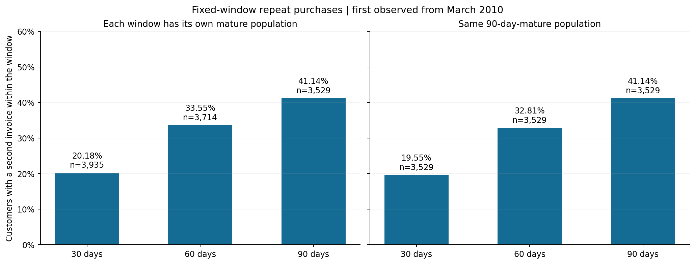

# Turning purchase history into a retention measurement plan

## Executive summary

**Business question:** How should an e-commerce team prioritize second-purchase, reactivation, and customer-service initiatives using observed transaction history?

This independent portfolio project analyzes **UCI Online Retail II**, a historical UK gift retailer with wholesale activity. It demonstrates an analytical workflow relevant to a marketplace team; it does not describe Shopee, Lazada, or current Vietnamese consumers. All financial results retain the source currency, GBP.

After auditing 1,067,371 source lines, the analysis retained **972,818 merchandise lines, 38,615 invoices, and 5,821 identified customers** across 24 complete months. Three findings guide the proposed decisions:

1. **1,452 of 3,529 eligible customers purchased again within 90 days: 41.14%.** This is a mature, first-observed customer population, not all customers in the file.
2. **The highest-spending 583 customers contributed 63.56% of identified historical gross merchandise sales.** Customer service and retention measurement should account for this concentration.
3. **1,728 historically repeat-purchasing accounts had been inactive for more than 90 days at the snapshot.** They form a rule-based reactivation investigation pool, not a confirmed churn list or guaranteed recoverable revenue.

The recommended next step is a measured second-purchase pilot, supported by improved customer identification, with a separate reactivation experiment. No campaign has been deployed and no commercial uplift is claimed.

## 1. Decision context and data

Growth and CRM teams need a consistent answer to three questions: who returns, where historical customer value is concentrated, and which intervention deserves testing. Commercial managers also need to know whether apparent differences between customer groups survive basic comparability checks.

The workbook covers December 2009 through December 9, 2011. Headline analysis uses purchases **before December 1, 2011**, avoiding the incomplete final month. Cohorts start from the first observed purchase, which may differ from a customer's first-ever purchase. Primary cohort reporting starts in March 2010; earlier history remains available for identifying previous purchasing and measuring recency.

The source contains invoice, product, quantity, price, timestamp, customer ID, and country fields. It has no native acquisition channel, category, discount, delivery, margin, or campaign exposure variables. Those questions cannot be answered from this dataset.

**Financial definition:** gross positive merchandise purchases before credits. These amounts are not net revenue, profit, or predicted lifetime value. Unidentified purchases contribute to business totals but cannot enter customer retention metrics.

Source and decision record: [dataset selection](dataset_selection.md), [source manifest](../data/raw/source_manifest.json), and [metric contract](../data_dictionary.md).

## 2. Preparing trustworthy analytical tables

The workflow preserves the original workbook and raw row lineage, then uses SQL and Python to create invoice, customer, and activity tables. Material issues included:

- **Missing customer identity:** 243,007 raw lines lacked customer IDs. After cleaning, identified purchases represented **87.25% of gross merchandise sales** and **92.58% of invoices**. Retention findings apply to the linked population.
- **Worksheet overlap and duplicate rows:** duplicate invoice payloads across overlapping sheets and repeated lines within a sheet required separate rules. A sensitivity calculation retained within-sheet duplicates to assess their influence.
- **Conflicting headers and product roles:** inconsistent invoice headers were quarantined. A versioned product mapping separated merchandise from charges, vouchers, and unresolved records.
- **Excel price precision:** tiny storage tails were normalized only within the documented tolerance. Original values and correction flags remain traceable.
- **Unresolved exposure:** 846 otherwise eligible lines worth **GBP 338,725.57** remained excluded because their product role was unresolved. This exposure equals about 1.79% of retained gross merchandise sales; it is not an estimate of lost revenue.

The retained business total is **GBP 18,933,017.23**, including **GBP 16,518,355.99** linked to customer IDs. SQL aggregates reconcile to independent invoice-level calculations. See the [audit](data_quality_report.md), [cleaning decisions](cleaning_report.md), and [monthly KPIs](monthly_kpis_report.md).

## 3. What the analysis found

### Finding A: Second purchasing is a useful, measurable intervention target

For a common population of **3,529 customers with complete 90-day follow-up**, repeat purchasing progresses as follows:

| Window from first observed purchase | Repeat customers | Eligible customers | Repeat rate |
|---|---:|---:|---:|
| 30 days | 690 | 3,529 | 19.55% |
| 60 days | 1,158 | 3,529 | 32.81% |
| 90 days | 1,452 | 3,529 | 41.14% |

Using the same population makes these three rates comparable. Separate own-window rates have different denominators and are available in the supporting table. Customers without a complete window are excluded from both numerator and denominator, including customers who have already repeated.

Among the 1,452 customers who repeated within 90 days, the median time to second purchase was **32.00 days**. This conditional statistic does not describe customers who never repeated and does not establish the optimal contact date.

The monthly cohort heatmap measures purchasing in each calendar month after the first observed month. Customers may skip months and return later. Future cells remain missing, and Month 0 is 100% by definition. This metric should be monitored alongside elapsed-day repeat rates, with cohort age and seasonality considered before interpreting differences.

Evidence: [repeat-purchase table](../data/processed/repeat_purchase_summary.csv), [cohort table](../data/processed/cohort_retention.csv), and [retention methodology](retention_analysis.md).

### Finding B: Historical spending is concentrated

The top **583 of 5,821 customers**, ranked by historical identified gross purchases, contributed **GBP 10,499,700.03**, or **63.56%** of the identified total. This suggests a need to monitor service continuity and dependence on large accounts.

RFM uses a December 1, 2011 snapshot. Recency uses all available history; frequency and monetary value use the preceding 12 months. The segmentation retains **1,530 dormant accounts** with no purchases in that year. The **957 Champions** contributed **66.90%** of trailing-year identified gross sales, although high monetary contribution is partly built into the segment definition.

On equal 90-day follow-up, mean observed customer sales were **GBP 682.83**, compared with a median of **GBP 369.02**. Both include the first purchase. The gap illustrates a skewed observed distribution; neither number is a lifetime-value forecast.

Keeping within-sheet duplicates changes the top-customer share to **63.48%**. Excluding one unusually large invoice with an apparent corresponding credit changes it to **63.42%**. Concentration persists under these specific sensitivity cases, while return-adjusted profitability remains unknown.

Evidence: [RFM segments](../data/processed/rfm_segments.csv), [sensitivity results](../data/processed/rfm_sensitivity.csv), and [customer analysis](customer_value_and_segments.md).

### Finding C: Reactivation scope depends on the operational definition

Requiring at least two historical purchases gives **2,071**, **1,728**, or **1,543** candidates at inactivity thresholds greater than 60, 90, or 120 days respectively. The 90-day pool is larger than the 591-member At-risk repeat RFM segment because it uses historical frequency and includes dormant repeat purchasers.

The 1,728 candidates previously contributed **GBP 2,917,464.33**. That is past spending, not money a campaign can necessarily recover. A live implementation would refresh eligibility against current purchase activity before treatment.

Evidence: [reactivation thresholds](../data/processed/reactivation_thresholds.csv) and the [rule definitions](../data_dictionary.md).

### Finding D: Basket differences support hypotheses; geography is weak evidence

Customers with first baskets of **GBP 250 or more** had a raw 90-day repeat rate of **46.95% (917/1,953)**, compared with **34.89% (447/1,281)** for baskets of GBP 100 to less than GBP 250. Customers purchasing six or more distinct products also repeated more often than single-product buyers. These characteristics overlap and may reflect wholesale behavior, purchasing intent, or cohort composition.

Cohort-standardized basket-value results are withheld because a shared comparison group has only 64 customers. Product-diversity groups have no shared cohort months meeting the required group counts. These safeguards prevent an unsupported adjusted ranking.

Geography is an informative weak result: raw rates are **41.10% for UK customers** and **41.76% for other known countries**. Across eight shared cohort months, standardized rates are **41.77% and 39.82%**, respectively. The small ordering changes. This evidence does not support reallocating acquisition budget by country.

Raw group intervals use 95% Wilson intervals. Groups smaller than 100 retain counts but suppress headline rates. These exploratory comparisons do not estimate causal effects or correct for every potential confounder.

Evidence: [group comparisons](../data/processed/customer_comparisons.csv), [cohort counts](../data/processed/comparison_by_cohort.csv), and [standardization details](customer_analysis_summary.json).

## 4. Recommended actions and how to evaluate them

### Priority 0: Improve the measurement population

**Owner:** analytics and data operations. Investigate missing customer identifiers and ambiguous merchandise codes before operationalizing the segments. Preserve valid anonymous purchases in sales totals and avoid speculative customer matching.

**Success measures:** identified invoice and sales coverage, unresolved-value exposure, and sampled identity-match accuracy. Monitor whether coverage differs by month or order value. Higher coverage alone does not prove better retention; record any population changes when comparing periods.

### Priority 1: Test a second-purchase program

**Owner:** CRM with analytics. On suitable contemporary data, enroll eligible first-observed purchasers and randomize at customer level into a contact program and a business-as-usual holdout. Stratify assignment by first-basket value and enrollment period. Start with a simple relevant follow-up; determine message and timing before the test rather than treating the historical median as an optimal schedule.

**Primary outcome:** intention-to-treat 90-day repeat rate, measured for every assigned customer after full follow-up. Report the treatment-minus-control difference and confidence interval. Secondary outcomes are 90-day gross sales per assigned customer and time to second purchase. Guardrails include unsubscribes, refunds, contact cost, and contribution margin where available.

Set sample size using a baseline from the actual eligible population, a minimum worthwhile effect, significance level, and power before launch. The historical 41.14% rate is context, not a guaranteed pilot baseline. Allow enrollment time plus 90 days of observation; do not stop early after a favorable interim result.

### Priority 2: Run a separate reactivation experiment

**Owner:** CRM. Refresh the historical-repeat and inactivity rules on current data. Test the greater-than-90-day rule first as a documented starting point, with randomization within recency and historical-value strata. The historical 1,728 accounts illustrate scale only; they are not a usable modern contact list.

**Primary outcome:** incremental purchasing within 60 days of assignment. This clock starts at assignment, unlike the first-purchase metric above. Track sales per assigned customer, contact costs, and returns, and use a holdout to separate natural return from campaign response. Avoid overlapping assignment with the second-purchase experiment.

### Priority 3: Monitor valuable accounts and test service support

**Owner:** customer operations and commercial management. Track concentration, recent activity, and service issues among large accounts. Investigate whether the observed wholesale component needs a distinct service process. Do not infer profitability or automatically allocate all retention spending to the highest spenders.

**Evaluation:** if a service intervention is feasible, compare randomized eligible accounts with standard service, using a prespecified purchasing window and sales per assigned account. Add service cost, margin, and complaints as guardrails. Refresh segment membership on a fixed schedule, while keeping assignment groups stable for evaluation.

**Budget decision:** country-level differences do not currently justify separate acquisition allocations. Collect stronger local evidence before making that decision.

## 5. Limitations and delivered outcome

The source is old, UK-specific, gift-oriented, and partly wholesale. Customer IDs represent accounts; they need not correspond one-to-one with people. Missing identity, unresolved product records, excluded header conflicts, incomplete pre-dataset history, and credits affect interpretation. RFM thresholds are explicit operational choices, not validated churn predictions. Acquisition costs, discounts, returns linkage, margins, and campaign outcomes are unavailable.

The completed outcome is a reproducible analytical portfolio: documented definitions, raw-data audit, SQL transformations, independently checked metrics, one executed notebook, six charts, an aggregate HTML dashboard, and this decision-oriented report. It provides evidence and experiment designs; it does not demonstrate achieved retention improvement.

For execution instructions and verification evidence, see the [README](../README.md) and [reproducibility report](reproducibility.md).

## Source attribution

Chen, D. (2012). *Online Retail II* [Dataset]. UCI Machine Learning Repository. [DOI: 10.24432/C5CG6D](https://doi.org/10.24432/C5CG6D). Dataset licensed under [CC BY 4.0](https://creativecommons.org/licenses/by/4.0/). The source workbook is unchanged; transformations are documented in this repository.
