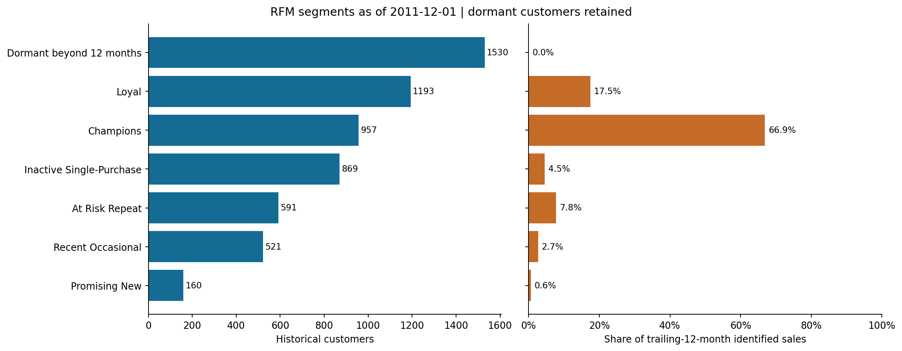
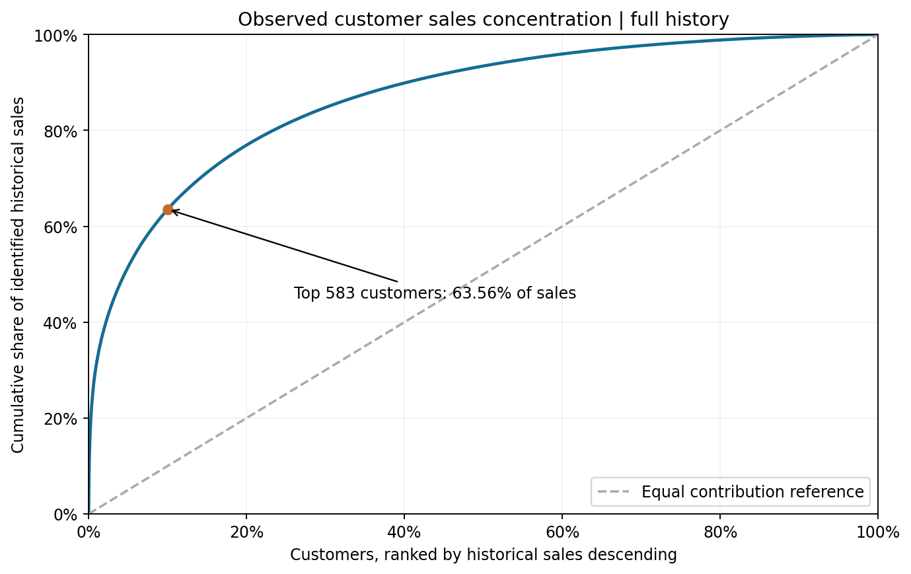
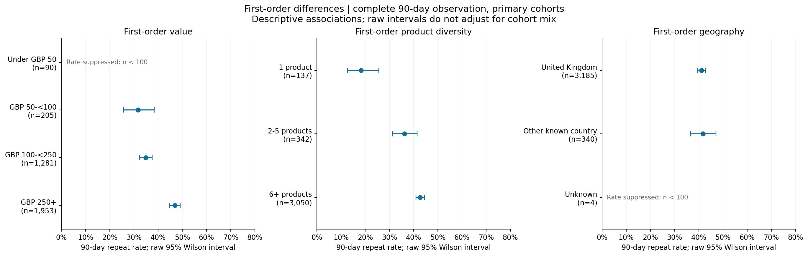

# Steps 11-12 - Customer Value, RFM and Business Differences

**Status: complete under contract 1.1.** Snapshot: 2011-12-01. Source: historical UK retail with wholesale activity; GBP. The executed [customer notebook](../notebooks/ecommerce_retention_analysis.ipynb) supports this report. Run `python src/customer_analysis.py` followed by `python src/visualize_analysis.py` to rebuild the tables, aggregate exports and five figures. The report contains curated interpretation; review its narrative if inputs change.

## RFM implementation and coverage

R uses full-history last purchase; F and M use [2010-12-01,2011-12-01). All **5,821 historical identified customers** remain in the snapshot. The **1,530 dormant customers** have zero trailing-year F/M and null R/F/M scores. Scores for active customers use the prescribed midrank formula: identical values receive identical scores, and dormant customers do not alter the active score distribution. Segments use the documented first-match precedence.

| Segment | Customers | Trailing-year gross merchandise sales GBP | Share of identified trailing-year sales |
|---|---:|---:|---:|
| Dormant beyond 12 months | 1,530 | 0.00 | 0.00% |
| Loyal | 1,193 | 1,434,580.86 | 17.48% |
| Champions | 957 | 5,488,996.99 | 66.90% |
| Inactive Single-Purchase | 869 | 372,912.87 | 4.55% |
| At Risk Repeat | 591 | 638,470.82 | 7.78% |
| Recent Occasional | 521 | 217,899.57 | 2.66% |
| Promising New | 160 | 51,868.48 | 0.63% |

Champions represent 957 customers and 66.90% of identified trailing-year sales. High spending is part of their definition, so this concentration within Champions is partly by construction. The At Risk Repeat segment has 591 customers; it is a rules-based operational label, not proof of permanent churn. Single-Purchase refers to trailing-year frequency, not necessarily all history.

## Customer value and concentration

The top **583 customers** (ceil(10% of 5,821), ties ordered by customer ID) contributed **63.56%** of the **GBP 16,518,355.987** identified historical gross sales. The denominator excludes unidentified sales. This is historical value, not predicted lifetime value or profit, and longer observed tenure can increase historical totals.

For a comparable observation length, the 3,529 primary-cohort customers with a full 90-day window have median first-90-day sales of **GBP 369.02** and mean **GBP 682.83**, including the first purchase. The large mean/median gap is consistent with spending concentration. These measures are available in `customer_value`; incomplete windows remain null. First-order value bands mechanically include different initial spending, so higher total 90-day sales in a high-value band is not independent evidence of stronger retention.

## Sensitivity and reactivation scope

| Alternative calculation | Customers with different M score | Customers with different segment | Top-10% historical sales share |
|---|---:|---:|---:|
| keep_within_sheet_duplicates | 36 | 4 | 63.48% |
| exclude_invoice_541431 | 3 | 1 | 63.42% |

All alternatives recompute distributions and scores; they do not simply change M while retaining old ranks. Excluding the apparent reversal candidate 541431 changes one segment and does not remove a historical customer, because that account has other history. The primary analysis retains the invoice under the gross-purchase definition. These checks suggest the overall concentration pattern is not driven by these two specific choices; they do not resolve all data limitations.

Reactivation candidates require at least two historical purchases and recency strictly greater than the chosen threshold, including dormant repeat customers:

| Recency threshold, days | Candidate customers | Their historical sales GBP |
|---|---:|---:|
| 60 | 2,071 | 3,754,788.85 |
| 90 | 1,728 | 2,917,464.33 |
| 120 | 1,543 | 2,455,693.26 |

The 90-day rule identifies **1,728 candidates**, a broader population than the At Risk Repeat segment because frequency here uses full history. Their past spending is not forecast recoverable revenue. Contact details and consent are unavailable; no outreach list or realized campaign uplift is claimed.

## First-order differences with equal follow-up

All comparisons use the same **3,529 primary-cohort customers with complete 90-day observation**. Features are frozen at the first invoice. Reported intervals are raw 95% Wilson binomial intervals, not simultaneous multiple-comparison intervals. Counts remain visible for groups with n<100, but their headline rates and intervals are suppressed.

| Feature | Group | Eligible n | Repeated x | 90-day repeat rate | Raw 95% Wilson interval |
|---|---|---:|---:|---:|---|
| first_order_value_band | Under GBP 50 | 90 | 23 | Suppressed / unavailable | Suppressed |
| first_order_value_band | GBP 50-<100 | 205 | 65 | 31.71% | 25.72% to 38.36% |
| first_order_value_band | GBP 100-<250 | 1,281 | 447 | 34.89% | 32.33% to 37.55% |
| first_order_value_band | GBP 250+ | 1,953 | 917 | 46.95% | 44.75% to 49.17% |
| first_order_product_band | 1 product | 137 | 25 | 18.25% | 12.68% to 25.55% |
| first_order_product_band | 2-5 products | 342 | 124 | 36.26% | 31.34% to 41.48% |
| first_order_product_band | 6+ products | 3,050 | 1,303 | 42.72% | 40.98% to 44.48% |
| first_order_geography | United Kingdom | 3,185 | 1,309 | 41.10% | 39.40% to 42.82% |
| first_order_geography | Other known country | 340 | 142 | 41.76% | 36.64% to 47.07% |
| first_order_geography | Unknown | 4 | 1 | Suppressed / unavailable | Suppressed |

First-order value of GBP 250+ is associated with 46.95% repeating, compared with 34.89% for GBP 100-<250 and 31.71% for GBP 50-<100. This is a prioritization hypothesis, not evidence that making a customer spend more causes them to return. Under GBP 50 has only 90 customers and is not ranked.

Product diversity shows 18.25% for one product and 42.72% for six or more, but the one-product group has only 137 customers and basket value may confound that comparison. A predefined joint breakdown in [basket value x product diversity](../data/processed/basket_value_product_comparison.csv) shows that, within six-plus-product baskets, the GBP 100-<250 group repeats at **35.33% (402/1,138)** versus **47.39% (870/1,836)** for GBP 250+. This descriptive conditional check leaves cohort mix and other confounding unresolved. Small joint cells are suppressed; it is not an experiment.

Geography has a weak raw difference: UK 41.10% versus other known countries 41.76%, with overlapping intervals. This does not support a geographic retention-budget preference. Unknown geography has only four eligible customers and is displayed as a coverage gap.

## Cohort-mix assessment

Every compared group uses the same selected cohort months, at least 20 eligible customers per group-month, and weights proportional to pooled eligible customers in those months. Only full-population groups with n>=100 enter the comparison. The n>=100 publishing rule is also applied to the restricted shared population: if any compared group falls below it, the feature's adjusted rates are suppressed. No raw Wilson interval is attached to a standardized rate. Month lists and exact weights are recorded in [the summary](customer_analysis_summary.json); [cohort counts](../data/processed/comparison_by_cohort.csv) support review.

| Feature | Group | Shared months | Shared eligible n | Standardized rate |
|---|---|---:|---:|---:|
| first_order_value_band | GBP 50-<100 | 3 | 64 | Suppressed / unavailable |
| first_order_value_band | GBP 100-<250 | 3 | 397 | Suppressed / unavailable |
| first_order_value_band | GBP 250+ | 3 | 659 | Suppressed / unavailable |
| first_order_product_band | 1 product | 0 | 0 | Suppressed / unavailable |
| first_order_product_band | 2-5 products | 0 | 0 | Suppressed / unavailable |
| first_order_product_band | 6+ products | 0 | 0 | Suppressed / unavailable |
| first_order_geography | United Kingdom | 8 | 1958 | 41.77% |
| first_order_geography | Other known country | 8 | 203 | 39.82% |

- Value bands share three suitable months, but GBP 50-<100 has only 64 customers in that restricted population. Adjusted rates are suppressed for this feature rather than changing the comparison groups after seeing results.
- Product-diversity groups have no shared month satisfying all minimum cell counts. No adjusted product ranking is published.
- Geography has eight shared months and adequate group totals. Standardized UK/other-country rates are **41.77% and 39.82%**, reversing the small raw ordering. This supports caution about geography, not a causal adjusted effect. Standardization addresses cohort timing only.

## Business hypotheses to carry into the case study

1. Test a second-purchase intervention by first-basket value, with random assignment within eligible groups and a no-intervention control. Compare incremental 90-day repeat rate and incremental sales per assigned customer; monitor incentive costs before drawing profitability conclusions. The observed band difference is a reason to test, not guaranteed uplift.
2. Evaluate a reactivation trial among the 1,728 repeat-history accounts inactive for more than 90 days. Stratify by recency and prior frequency, use a randomized holdout, and measure incremental purchasing over a fixed follow-up. Historical account value is not the intervention's expected return.
3. Monitor concentrated customer sales and service issues, while testing whether retention support adds incremental value. Preserve the documented credit/outlier limitations. Avoid directing all budget to the top decile merely because it spends most.
4. Treat geography as a reporting dimension for now. The small, cohort-sensitive differences do not justify selecting countries for retention spending on this evidence alone.

These proposals are developed into evaluation plans in the [final case study](case_study.md); no campaigns have been implemented. No discount, product-category, delivery or payment analyses were invented because the source lacks those fields.

## Verification, artifacts and limits

The runner independently reconstructed all primary and sensitivity RFM features from invoices, checked tie scores and segment precedence, reconciled trailing-year M, checked historical ranks and every 90-day sales value, verified first-order feature provenance, and reconciled all five Parquet exports. Synthetic cases exercised dormant customers, the trailing-year start boundary, recency 90/91, first purchase at 30/31 days, all-tied scores, Wilson calculations, common-cohort weights and suppression. Both notebooks executed successfully.

Data scope remains restricted to eligible classified merchandise. Unknown customers, GBP 338,725.57 unresolved manual/sample/image exposure, quarantined headers, unverified refund linkage, wholesale activity and historical coverage affect generalization. Account IDs are not verified people. This UK historical source does not establish modern Vietnamese marketplace behavior.

A supplementary [local executive dashboard](../dashboard/index.html) provides cohort and comparison selectors using aggregate data only. It is a browser-based deliverable; no Power BI `.pbix` file is included. A usable Power BI Desktop execution environment was not established, so this supplement uses the validated local outputs. Core SQL/notebook analysis is complete. The [final case study](case_study.md) and [reproducibility review](reproducibility.md) complete Steps 13-14.
