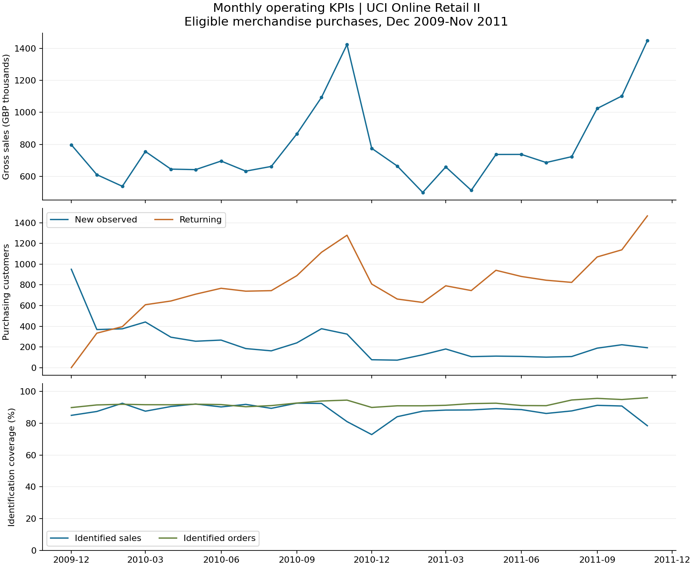

# Step 7 - Monthly Operating KPIs

**Status:** complete. **Scope:** eligible positive merchandise invoices from December 2009 through November 2011, GBP, contract 1.1. The partial December 2011 is excluded.

## Run and inspect

After the audit and cleaning commands in the [README](../README.md), run `python src/monthly_kpis.py`. This executes [02_monthly_kpis.sql](../sql/02_monthly_kpis.sql), validates every month against independent Python invoice aggregation, and replaces the DuckDB `monthly_kpis` table. It exports `data/processed/monthly_kpis.parquet`, the small tracked [monthly CSV](../data/processed/monthly_kpis.csv), [validation summary](monthly_kpis_summary.json), and the chart below. SQL uses a registered Decimal division helper for AOV and should be executed through the runner.

The runner verifies the raw workbook and product-mapping hashes against the cleaning summary, checks cleaned counts and totals, and records an input-table fingerprint. Rebuild cleaning first after changing its inputs or rules. If export is interrupted after database commit, rerun this command to refresh all outputs. Other analysis tables are not refreshed by this command.

## Definitions

- **Orders:** distinct eligible invoices, including unidentified invoices. Sum invoice totals once; never multiply header totals by joined item rows.
- **Gross merchandise sales:** sum of eligible positive merchandise sales, before credit adjustments. This does not establish net revenue, profit or settled cash.
- **AOV:** sales divided by orders. Exact Decimal sums feed Decimal division; the stored ratio is half-up rounded to six decimals and displayed to two. Counts and money totals retain their exact values.
- **Active customers:** distinct identified purchasing accounts in a month. **New observed:** first eligible purchase falls in that month. **Returning:** first purchase was earlier. Several purchases in a customer's first month still count as one new customer.
- **Returning-customer share:** returning / active customers; this is customer composition, not a retention rate.
- **Identification coverage:** identified orders / all orders and identified sales / all sales. Unidentified transactions contribute to overall sales but do not create a customer identity.
- **Sales MoM growth:** sales / previous calendar month's sales minus one. The first month and a zero previous-sales denominator yield null. Growth ratios and shares use floating point; money totals use Decimal.
- A calendar spine retains all reporting months. An empty observed month gets zero counts/sales and null zero-denominator ratios. Monthly active customers cannot be summed to obtain unique customers over the whole period.

## Reconciled period totals

| Measure | Result |
|---|---:|
| Complete reporting months | 24 |
| Eligible invoices | 38,615 |
| Gross merchandise sales (GBP) | 18,933,017.23 |
| Period AOV, total sales / total orders (GBP) | 490.30 |
| Distinct identified customers | 5,821 |
| Identified-order coverage | 92.6% |
| Identified-sales coverage | 87.2% |

Period AOV and coverage use period numerators and denominators, not an unweighted average of monthly percentages. Exact six-decimal money is retained in the CSV/JSON and database.

## Monthly results

| Month | Orders | Gross sales GBP | AOV GBP | Active customers | New observed | Returning | Identified sales | Sales MoM |
|---|---:|---:|---:|---:|---:|---:|---:|---:|
| 2009-12 | 1,665 | 797,558.34 | 479.01 | 951 | 951 | 0 | 85.0% | N/A |
| 2010-01 | 1,048 | 610,665.93 | 582.70 | 701 | 368 | 333 | 87.4% | -23.4% |
| 2010-02 | 1,189 | 537,909.68 | 452.41 | 771 | 375 | 396 | 92.6% | -11.9% |
| 2010-03 | 1,642 | 755,578.67 | 460.16 | 1,049 | 441 | 608 | 87.6% | 40.5% |
| 2010-04 | 1,433 | 645,291.65 | 450.31 | 938 | 294 | 644 | 90.5% | -14.6% |
| 2010-05 | 1,483 | 642,102.77 | 432.98 | 965 | 255 | 710 | 92.1% | -0.5% |
| 2010-06 | 1,610 | 695,766.41 | 432.15 | 1,033 | 266 | 767 | 90.3% | 8.4% |
| 2010-07 | 1,506 | 632,720.36 | 420.13 | 923 | 184 | 739 | 91.9% | -9.1% |
| 2010-08 | 1,393 | 662,154.78 | 475.34 | 906 | 162 | 744 | 89.4% | 4.7% |
| 2010-09 | 1,780 | 865,079.98 | 486.00 | 1,128 | 239 | 889 | 92.6% | 30.6% |
| 2010-10 | 2,242 | 1,093,770.34 | 487.85 | 1,491 | 376 | 1,115 | 92.5% | 26.4% |
| 2010-11 | 2,712 | 1,423,885.23 | 525.03 | 1,604 | 324 | 1,280 | 81.0% | 30.2% |
| 2010-12 | 1,549 | 775,440.04 | 500.61 | 884 | 76 | 808 | 72.9% | -45.5% |
| 2011-01 | 1,074 | 664,925.64 | 619.11 | 735 | 72 | 663 | 84.1% | -14.3% |
| 2011-02 | 1,085 | 499,710.09 | 460.56 | 754 | 124 | 630 | 87.6% | -24.8% |
| 2011-03 | 1,434 | 659,068.93 | 459.60 | 971 | 180 | 791 | 88.3% | 31.9% |
| 2011-04 | 1,229 | 512,756.87 | 417.21 | 851 | 106 | 745 | 88.4% | -22.2% |
| 2011-05 | 1,663 | 736,844.74 | 443.08 | 1,052 | 111 | 941 | 89.2% | 43.7% |
| 2011-06 | 1,524 | 737,187.60 | 483.72 | 989 | 108 | 881 | 88.6% | 0.0% |
| 2011-07 | 1,451 | 686,570.97 | 473.17 | 946 | 101 | 845 | 86.1% | -6.9% |
| 2011-08 | 1,337 | 723,134.75 | 540.86 | 931 | 107 | 824 | 87.7% | 5.3% |
| 2011-09 | 1,817 | 1,024,404.36 | 563.79 | 1,258 | 188 | 1,070 | 91.3% | 41.7% |
| 2011-10 | 2,003 | 1,102,398.68 | 550.37 | 1,360 | 221 | 1,139 | 90.8% | 7.6% |
| 2011-11 | 2,746 | 1,448,090.41 | 527.35 | 1,659 | 192 | 1,467 | 78.4% | 31.4% |

The CSV also includes identified/unidentified order and sales amounts, previous-month sales, returning-customer share and identified-order share.

## Observations and interpretation limits

- The highest observed monthly gross sales were **1,448,090.41 GBP in 2011-11**, with **2,746 invoices**. This ranks the available months and does not establish why sales changed.
- Identified-sales coverage was lowest in **2010-12: 72.9%**. Customer behavior results cover identified transactions and may not represent unidentified buyers.
- December 2009 is the beginning of observed history. Its buyers are classified as first observed, even if they bought before the extract. Changes in new/returning composition therefore partly reflect accumulated observation history.
- The Step 6 exclusions remain in force: unresolved manual/sample/image exposure was GBP 338,725.57, and conflicting invoice headers were quarantined. Missing IDs, wholesale orders, source date gaps and unverified refund linkage limit interpretation. Invoice 541431 remains in January 2011 under the documented gross-purchase policy; its GBP 77,183.60 value can affect that month's AOV.

## Verification and next step

All 24 monthly rows matched independent Python aggregation from the cleaned invoices, including exact sales, customer composition, coverage ratios and prior-calendar-month growth. Period counts and money reconcile to Step 6. Synthetic cases cover an empty month, repeated purchases by a new customer, a returning customer, unidentified-only activity, zero denominators and exclusion of the cutoff month. CSV and Parquet outputs were checked against the database.

For completed downstream findings, see [repeat purchasing and cohorts](retention_analysis.md), [customer segments](customer_value_and_segments.md), and the [final case study](case_study.md).
